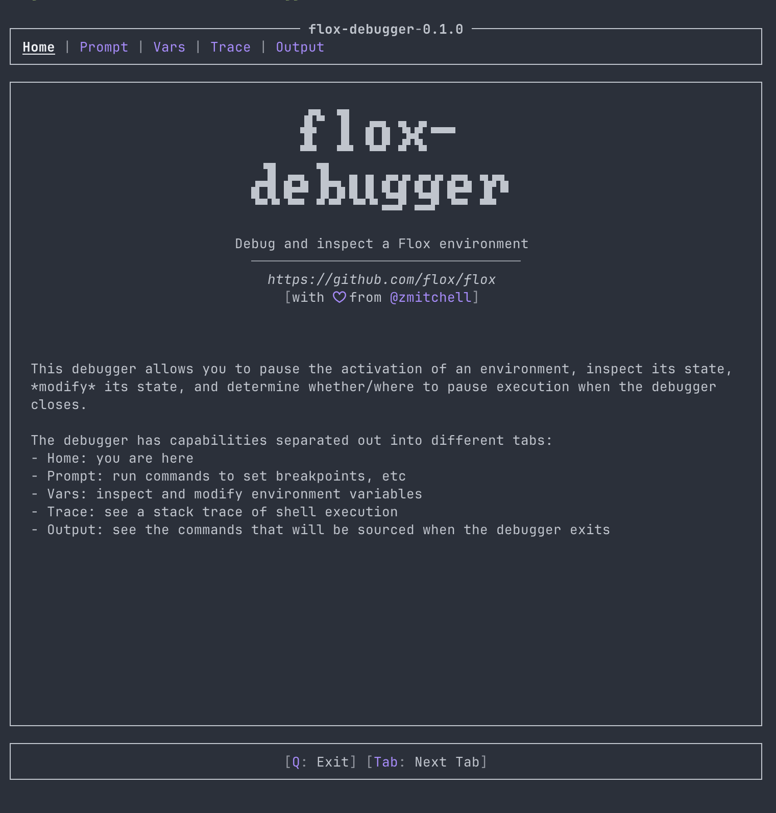

# flox-debugger

This is a debugger that drops you into a TUI when you hit a desired statically defined trace point in a shell script.
You use the `fdb_tracepoint` function in your script to define a tracepoint.
You invoke the debugger by running your script with the `FLOX_DBG_TRACEPOINT` environment variable set to one of:
- The name of a tracepoint
- `next`, which will stop at the next available tracepoint
- `all`, which will stop at each tracepoint

## License

Licensed under either of

 * Apache License, Version 2.0, ([LICENSE-APACHE](LICENSE-APACHE) or http://www.apache.org/licenses/LICENSE-2.0)
 * MIT license ([LICENSE-MIT](LICENSE-MIT) or http://opensource.org/licenses/MIT)

at your option.

### Contribution

Unless you explicitly state otherwise, any contribution intentionally
submitted for inclusion in the work by you, as defined in the Apache-2.0
license, shall be dual licensed as above, without any additional terms or
conditions.
